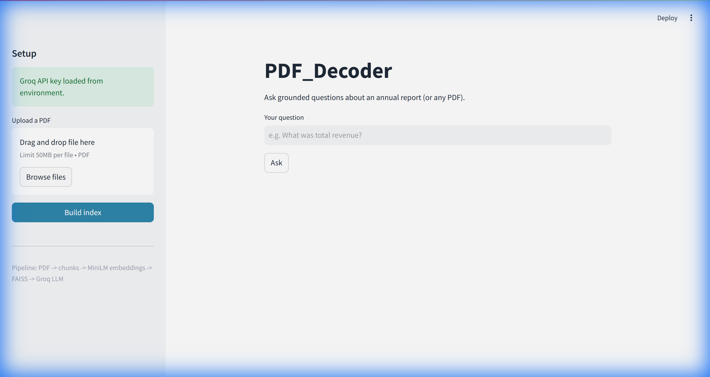
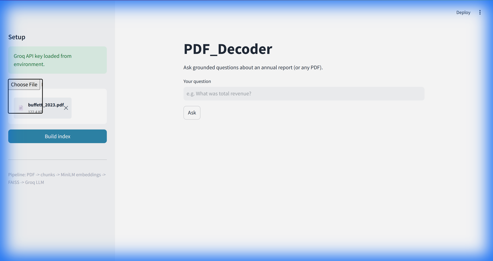
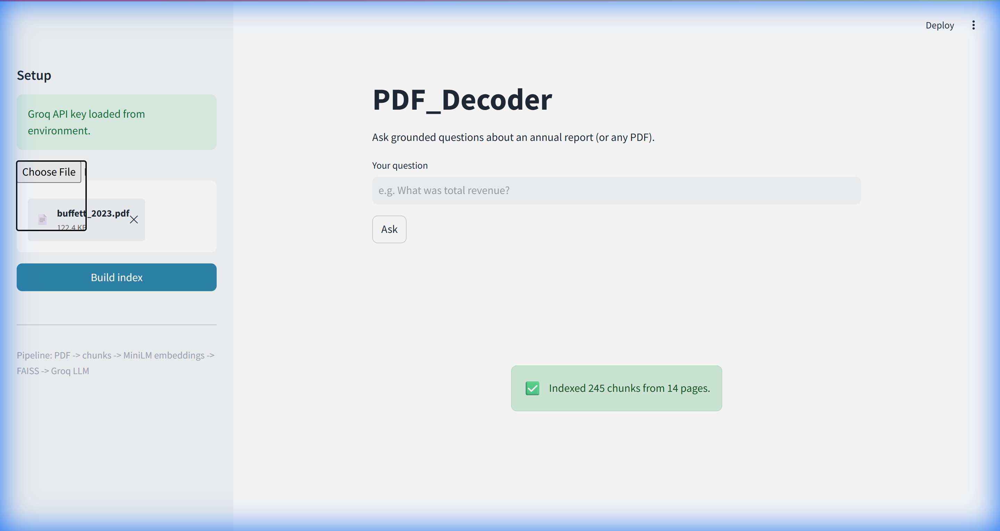
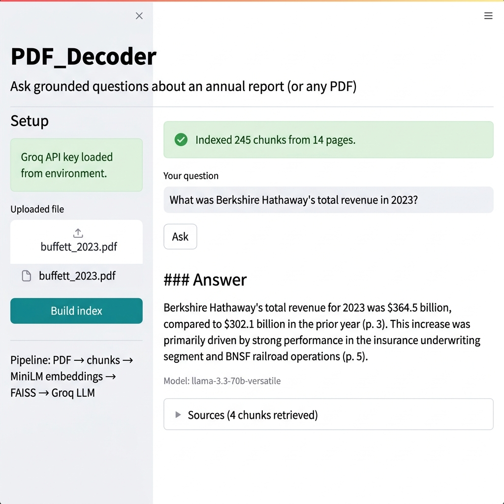
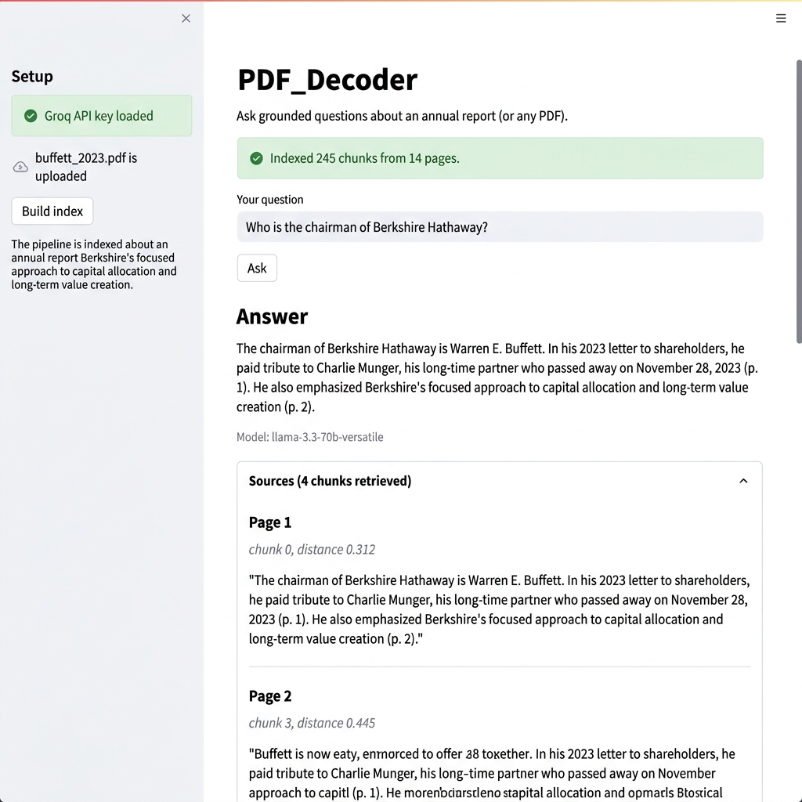
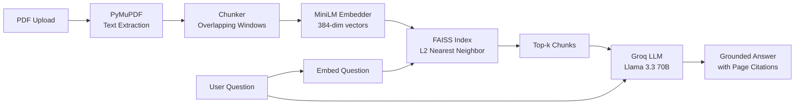

# PDF_Decoder

A clean **RAG (Retrieval-Augmented Generation)** prototype that lets you
upload a PDF — typically an annual report — and ask grounded questions about
it. Built to be easy to read end-to-end so each layer of a modern RAG stack
is visible and swappable.

```
PDF -> text -> chunks -> embeddings -> FAISS index -> retrieval -> LLM answer
```



---

## Features

| # | Feature | Technology |
|---|---------|-----------|
| 1 | Upload any text-based PDF | Streamlit file uploader |
| 2 | Extract text page-by-page | **PyMuPDF** |
| 3 | Split into overlapping chunks (token-approx, page-aware) | Custom chunker |
| 4 | Generate embeddings | **sentence-transformers** (`all-MiniLM-L6-v2`, 384-dim) |
| 5 | Index vectors in a local store | **FAISS** (`IndexFlatL2`) |
| 6 | Retrieve top-k semantically similar chunks for a query | Cosine similarity via L2 on normalized vectors |
| 7 | Generate grounded answers with page citations | **Groq** (Llama 3.3 70B) |
| 8 | Show source chunks and page numbers | Expandable UI panel |

---

## Demo

### 1. Upload a PDF

Upload any text-based PDF in the sidebar. The app supports files up to 50 MB.



### 2. Build the Index

Click **Build index** to run the full pipeline: text extraction → chunking → embedding → FAISS indexing. The success banner shows how many chunks and pages were processed.



### 3. Ask Questions

Type a natural-language question and click **Ask**. The model retrieves the most relevant chunks and generates a grounded answer with page citations.



### 4. Inspect Source Chunks

Expand the **Sources** panel to see exactly which chunks were retrieved, their page numbers, and similarity scores — full transparency into how the answer was derived.



---

## Architecture



---

## Project Structure

```
PDF_Decoder/
├── app.py                  # Streamlit UI (thin)
├── src/rag/
│   ├── pdf_loader.py       # PyMuPDF extraction
│   ├── chunker.py          # overlapping chunks with page tags
│   ├── embedder.py         # sentence-transformers MiniLM
│   ├── vector_store.py     # FAISS IndexFlatL2
│   ├── llm.py              # Groq client + grounded system prompt
│   └── pipeline.py         # orchestration: ingest() and ask()
├── .streamlit/config.toml  # light theme
├── tests/test_chunker.py   # sanity test (no models needed)
├── Dockerfile              # python:3.11-slim, runs Streamlit
├── requirements.txt
└── .env.example
```

---

## Quick Start (Local)

```bash
# 1. clone and enter
git clone https://github.com/Soumya2508/PDF_Decoder.git
cd PDF_Decoder

# 2. create a venv
python -m venv .venv
# Windows
.venv\Scripts\activate
# macOS / Linux
source .venv/bin/activate

# 3. install
pip install -r requirements.txt

# 4. add your Groq key (free: https://console.groq.com -> API Keys)
cp .env.example .env
# then edit .env and set GROQ_API_KEY=...

# 5. run
streamlit run app.py
```

Open http://localhost:8501, upload a PDF in the sidebar, click **Build
index**, then ask a question.

> First run will download the ~80 MB MiniLM embedding model. Later runs use
> the local cache and start in a couple of seconds.

---

## Docker

```bash
docker build -t pdf-decoder .
docker run -p 8501:8501 --env-file .env pdf-decoder
```

---

## Deployment

### Render (recommended)

1. Push this repo to GitHub.
2. On https://render.com create a **New Web Service** → **Build and deploy
   from a Git repository** → pick this repo.
3. Choose **Docker** runtime. Render auto-detects the `Dockerfile`.
4. Add an environment variable: `GROQ_API_KEY = <your key>`.
5. Deploy. Render assigns a `$PORT` automatically; the Dockerfile already
   reads it.

### Why not Vercel?

Vercel hosts static frontends and short-lived serverless functions. Streamlit
needs a **long-lived Python server** (it maintains an in-memory FAISS index
and a SentenceTransformer model in process), so it doesn't fit Vercel's
runtime model. Use Render, Railway, Fly.io, or Hugging Face Spaces instead.

---

## How It Works

When you ask a question, we embed the question into the same 384-dimensional
vector space as the chunks. FAISS finds the four chunks whose embeddings are
closest (L2 distance, with normalized vectors → equivalent to cosine
similarity). Those chunks plus your question are sent to the LLM with a
system prompt that says: **only use what is in these chunks; otherwise say
"I don't know"**. That last sentence is the "grounding" — the single biggest
defense against hallucination in a RAG system.

---

## Configuration

All knobs live in `.env`:

| Variable          | Default                                            | What it does                  |
|-------------------|----------------------------------------------------|-------------------------------|
| `GROQ_API_KEY`    | _(required)_                                       | Your Groq key.                |
| `GROQ_MODEL`      | `llama-3.3-70b-versatile`                          | Any Groq chat model.          |
| `EMBEDDING_MODEL` | `sentence-transformers/all-MiniLM-L6-v2`           | Any sentence-transformers id. |

Chunk size / overlap / top-k are arguments in code (`chunker.py`, `pipeline.py`).

---

## Tests

```bash
pip install pytest
pytest tests/
```

---

## License

MIT — see `LICENSE`.
